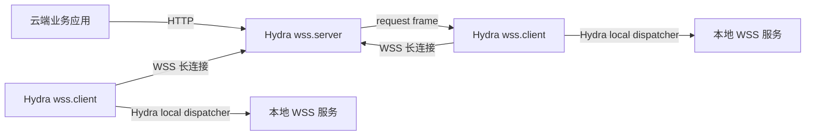

# Hydra WSS 长连接网关与隧道穿透设计方案

## 1. 目标

新增两个 Hydra 原生服务类型 `wss.server` 和 `wss.client`，替代并删除现有 `ws` 实现。`wss` 不再作为单独启动的服务类型，而是作为配置 builder 和代码包命名存在；实际启动、注册、配置监听都明确落到 `wss.server` 或 `wss.client`。

- `wss.server`：云端 A，监听 HTTP/WebSocket 接入，接收本地客户端 B 注册，维护连接池和服务路由，将外部 HTTP 请求转发到 B。
- `wss.client`：本地 B，作为 Hydra 应用主动连接云端 A，注册本地 Hydra WSS 服务，接收转发请求并调用本进程已注册的服务。

目标约束：

- 两端都使用 Hydra，统一服务启动、配置、注册、日志、热更新和关闭模型。
- 复用 Hydra 现有 `IResponsiveServer`、`RspServers`、`creator`、`conf/server`、`services`、`dispatcher`、`middleware` 和 `registry/pub` 模式。
- 连接池、心跳、重连、服务注册、服务摘除、超时、背压由 `wss.server` 和 `wss.client` 自动维护。
- 对外尽量只暴露一个 HTTP(S) 端口；实际是否 TLS 由 Hydra 直启 TLS 或外部 Nginx/SLB/Ingress 终止 TLS 决定。

## 2. 现有 Hydra 机制依据

本方案基于以下现有代码结构：

- 服务类型由 `global/iapp.go` 定义常量，并由 `global.ServerTypes` 保存支持列表。
- 应用通过 `WithServerTypes(...)` 指定启动服务类型，最终在 `global.Def.Bind` 中校验。
- 各服务通过 `servers.Register(tp, creator)` 注册为 `IResponsiveServer`。
- `RspServers` 监听注册中心路径 `/{plat}/{sys}/{serverType}/{cluster}/conf`，配置变化后创建或通知服务。
- 每个响应式服务实现：
  - `Start() error`
  - `Notify(app.IAPPConf) (bool, error)`
  - `Shutdown()`
- 配置通过 `conf/server/*` 包定义 main/sub 配置结构，使用 `cnf.GetMainObject` 和 `cnf.GetSubObject` 读取。
- `creator` 将配置发布到注册中心，main 节点固定名为 `main`，子配置通过 `BaseBuilder` 写入。
- WSS 可转发的本地业务服务通过 `hydra.S.WSS(...)` 或应用实例的 `app.WSS(...)` 注册，最终进入 `services.ORouter` 和 `services.Def.Call`。
- HTTP/RPC/MQC/CRON/AIGW 的 `Responsive` 都遵循 `DoSetup -> Start -> DoStarted -> publish -> Notify -> Shutdown -> DoClosing` 的生命周期。

因此 `wss.server` 和 `wss.client` 必须以“新增标准 Hydra server type”的方式接入，而不是独立后台组件；两端服务类型分开，避免一个配置节点靠 `mode` 字段承担两种生命周期。

## 3. 总体架构



`wss.server` 同时承担：

- WebSocket/WSS 长连接监听。
- 隧道客户端注册入口。
- HTTP 代理入口。
- 服务群组连接池。
- 请求多路复用和响应回写。

`wss.client` 同时承担：

- 主动连接 server。
- 自动认证、注册、心跳、重连。
- 本地服务调用适配。
- 本地路由变更后重新注册。

## 4. 服务类型与废弃策略

新增：

```go
const WSSServer = "wss.server"
const WSSClient = "wss.client"
```

对外建议在 `hydra` 根包 re-export，业务代码不直接书写字符串：

```go
const (
    WSSServer = global.WSSServer
    WSSClient = global.WSSClient
)
```

推荐处理：

- 新增 `global.WSSServer` 和 `global.WSSClient`。
- 新增 `hydra/servers/wss`。
- 新增 `conf/server/wss`。
- 新增 `creator/server.wss.go`。
- `services` 中新增 `services.WSSServer = NewORouter("WSS.SERVER")`，并在 `Def.servers` 初始化中注册 `global.WSSServer`。
- `wss.client` 不对外承载业务 WebSocket 服务，不需要业务 ORouter；它只负责连接云端、注册本地服务和本地分发。
- `creator.Conf.WSS(...)` 作为统一配置入口，根据 `wss.WithServerSide(...)` 或 `wss.WithClientSide(...)` 生成 `wss.server` 或 `wss.client` 配置。
- 删除旧 `global.WS`、`conf/server/ws`、`hydra/servers/http/ws`、`creator.Conf.WS/GetWS`、`services.Def.WS` 等所有 `ws` 相关入口和实现。

删除策略：

- 不做 deprecated 兼容，不保留 `Conf.WS(...)` 到 `Conf.WSS(...)` 的转发。
- 不保留 `services.Def.WS(...)` 注册入口。
- 不保留 `global.WS` 服务类型常量。
- 不保留 `ws` server type 启动能力。
- 原业务 WebSocket 场景统一迁移到显式的 `wss.server` 服务和 `hydra.S.WSS(...)`。

## 5. 目录设计

```text
conf/server/wss
  wss.go
  option.go
  service.go
  route.go

creator
  server.wss.go

hydra/servers/wss
  responsive.server.go
  responsive.client.go
  server.go
  client.go
  option.go
  upgrader.go
  frame.go
  codec.go
  session.go
  pool.go
  heartbeat.go
  reconnect.go
  pending.go
  route.table.go
  proxy.http.go
  dispatch.local.go
  registry.tunnel.go
  middleware.go
```

说明：

- `responsive.server.go` 注册并启动 `global.WSSServer`。
- `responsive.client.go` 注册并启动 `global.WSSClient`。
- `server.go` 只处理云端 server side。
- `client.go` 只处理本地 client side。
- `session/pool/heartbeat/pending` 是两端共用的连接基础设施。
- `proxy.http.go` 负责 `wss.server` 下 HTTP 请求转 tunnel frame。
- `dispatch.local.go` 负责 `wss.client` 下 tunnel frame 转本地服务。

## 6. 配置模型

配置仍沿用 Hydra 的配置模型，但这里的“注册中心”是每一端 Hydra 进程自己的配置来源，不要求云端 A 和本地 B 共用同一个注册中心。跨网络穿透链路只依赖 `wss.client.server` 指定的公网 WSS 地址。

```text
/{plat}/{sys}/wss.server/{cluster}/conf
/{plat}/{sys}/wss.server/{cluster}/conf/routes

/{plat}/{sys}/wss.client/{cluster}/conf
```

`cluster` 是 Hydra 原有配置命名空间，用来定位当前进程从哪里读取自己的配置；`group` 是 WSS 隧道连接池分组，用来决定外部 HTTP 请求转发给哪一组本地 B。两者没有映射关系，也不要求同名。

`conf/server/wss.ServerSide` 作为 `wss.server` main 配置：

```go
type ServerSide struct {
    security.ConfEncrypt
    Address    string `json:"address,omitempty" toml:"address,omitempty"`
    Status     string `json:"status,omitempty" valid:"in(start|stop)" toml:"status,omitempty"`
    Path       string `json:"path,omitempty" toml:"path,omitempty"`
    Trace      bool   `json:"trace,omitempty" toml:"trace,omitempty"`

    TLS        TLSConf        `json:"tls,omitempty" toml:"tls,omitempty"`
    Auth       AuthConf       `json:"auth,omitempty" toml:"auth,omitempty"`
    Heartbeat  HeartbeatConf  `json:"heartbeat,omitempty" toml:"heartbeat,omitempty"`
    Pool       PoolConf       `json:"pool,omitempty" toml:"pool,omitempty"`
    Proxy      ProxyConf      `json:"proxy,omitempty" toml:"proxy,omitempty"`
}
```

`conf/server/wss.ClientSide` 作为 `wss.client` main 配置：

```go
type ClientSide struct {
    security.ConfEncrypt
    Server   string `json:"server,omitempty" toml:"server,omitempty"`
    Status   string `json:"status,omitempty" valid:"in(start|stop)" toml:"status,omitempty"`
    Group    string `json:"group,omitempty" toml:"group,omitempty"`
    ClientID string `json:"clientID,omitempty" toml:"clientID,omitempty"` // 可选，默认自动生成
    Trace    bool   `json:"trace,omitempty" toml:"trace,omitempty"`

    Auth      AuthConf      `json:"auth,omitempty" toml:"auth,omitempty"`
    Heartbeat HeartbeatConf `json:"heartbeat,omitempty" toml:"heartbeat,omitempty"`
    Reconnect ReconnectConf `json:"reconnect,omitempty" toml:"reconnect,omitempty"`
    Pool      PoolConf      `json:"pool,omitempty" toml:"pool,omitempty"`
}
```

默认值：

```text
address = ":8443"
path = "/hydra/wss"
status = "start"
heartbeat.pingInterval = 25
heartbeat.pongTimeout = 75
heartbeat.writeTimeout = 10
pool.sendQueueSize = 256
pool.maxFrameSize = 1048576
pool.maxMessageSize = 52428800
pool.maxInflightPerClient = 128
pool.requestTimeout = 60
pool.balancer = "least_inflight"
reconnect.minInterval = 1
reconnect.maxInterval = 30
reconnect.factor = 2
proxy.enabled = true
proxy.prefix = "/"
```

最小必配原则：

- `wss.server`：默认可直接启动，端口、路径、心跳、连接池都有默认值；生产环境只建议额外配置认证。
- `wss.client`：必须知道连接哪个 server，以及自己属于哪个 group；`clientID` 自动生成，不要求用户配置。
- HTTP method 不进入 WSS 配置，原样透传给本地 Hydra 服务，由 `GetHandle/PostHandle/...` 等服务实现决定。
- 本地 Hydra 服务不需要在 `wss.client` 里重复声明，B 会自动使用当前进程已注册的 Hydra 服务表。

`wss.server` 最小示例：

```toml
[wss]
status = "start"

[wss.auth]
type = "apikey"
secret = "server-secret"
```

`wss.client` 最小示例：

```toml
[wss]
status = "start"
server = "wss://gateway.example.com/hydra/wss"
group = "store-01"

[wss.auth]
type = "apikey"
secret = "server-secret"
```

`clientID` 默认使用 Hydra 现有 `ServerID` 或 `machineCode + pid` 生成；只有需要固定节点名、稳定替换旧连接或排查问题时才配置。

`wss.client.server` 地址来源：

```text
client server = <公网可访问的 scheme + host + serverSide path>
```

- `scheme`：公网 TLS 终止后仍建议对 client 暴露 `wss://`；如果只在内网明文调试，可使用 `ws://`。
- `host`：由部署入口决定，可以是 SLB、Ingress、Nginx 或直接暴露的 Hydra 地址，例如 `gateway.example.com`。
- `path`：来自 `wss.server` 的 `Path` 配置，默认是 `/hydra/wss`。

因此 `wss://gateway.example.com/hydra/wss` 不是服务端自动拼出来下发给 client 的地址，而是部署者根据公网入口填写给 client 的连接地址。若经过 Nginx，Nginx 只需要把这个 path 的 WebSocket Upgrade 请求转发到 Hydra `wss.server` 的监听地址。

示例：

```text
公网入口: gateway.example.com
wss.server address: :8443
wss.server path: /hydra/wss
client server: wss://gateway.example.com/hydra/wss
```

如果 Nginx 对外使用自定义路径：

```text
公网入口: gateway.example.com
外部 path: /tunnel
Nginx proxy_pass: http://127.0.0.1:8443/hydra/wss
client server: wss://gateway.example.com/tunnel
```

此时 client 只关心外部完整地址；server 只关心自己实际监听的 `Path`。

跨网络部署时，client 必须显式配置 `server` 完整地址，不从云端注册中心发现 `wss.server`。A 和 B 可以分别使用自己的 `lm://.`、`fs://`、`zk://`、`consul://` 等配置来源；它们之间的唯一运行时通信通道就是这条 WSS 长连接。

默认 HTTP 分组规则：

```text
/{group}/{service-path}
```

例如外部请求 `/store-01/order/create`，A 自动识别 group 为 `store-01`，转发给该分组内某个 B，并把发给 B 的路径改为 `/order/create`。这个规则不需要配置。

## 6.1 完整最小示例

下面示例只配置必须项：云端配置认证；本地配置云端地址、所属分组和认证。端口、路径、心跳、重连、连接池、clientID 都由 WSS 默认处理。

### 6.1.1 云端 A：wss.server

云端 A 负责接收公网 HTTP 请求和本地 B 的 WSS 长连接。

`main.go`：

```go
package main

import (
    "github.com/micro-plat/hydra"
    _ "github.com/micro-plat/hydra/hydra/servers/wss"
)

func main() {
    app := hydra.NewApp(
        hydra.WithPlatName("demo"),
        hydra.WithSystemName("gateway"),
        hydra.WithServerTypes(hydra.WSSServer),
    )
    app.Start()
}
```

`conf.go`：

```go
package main

import (
    "github.com/micro-plat/hydra"
    "github.com/micro-plat/hydra/conf/server/wss"
)

func init() {
    hydra.Conf.WSS(
        wss.WithServerSide(
            wss.WithAuth("apikey", "server-secret"),
        ),
    )
}
```

发布后的核心配置形态：

```toml
[wss]
status = "start"

[wss.auth]
type = "apikey"
secret = "server-secret"
```

启动：

```powershell
gateway.exe run -p demo -s gateway -t wss.server -r lm://.
```

说明：Go 代码中使用 `hydra.WSSServer` 常量；CLI 的 `-t` 是命令行边界，只能使用字符串 `wss.server`。

### 6.1.2 本地 B：wss.client + store-01 分组

本地 B 负责主动连接云端 A，并把本地 `hydra.S.WSS(...)` 注册的服务暴露给 `store-01` 分组。

`main.go`：

```go
package main

import (
    "github.com/micro-plat/hydra"
    _ "github.com/micro-plat/hydra/hydra/servers/wss"
)

func main() {
    app := hydra.NewApp(
        hydra.WithPlatName("demo"),
        hydra.WithSystemName("store-client"),
        hydra.WithServerTypes(hydra.WSSClient),
    )
    app.Start()
}
```

`conf.go`：

```go
package main

import (
    "github.com/micro-plat/hydra"
    "github.com/micro-plat/hydra/conf/server/wss"
)

func init() {
    hydra.Conf.WSS(
        wss.WithClientSide(
            wss.WithServer("wss://gateway.example.com/hydra/wss"),
            wss.WithGroup("store-01"),
            wss.WithAuth("apikey", "server-secret"),
        ),
    )
}
```

`order_service.go`：

```go
package main

import "github.com/micro-plat/hydra"

func init() {
    hydra.S.WSS("/order", &OrderService{})
}

type OrderService struct{}

func (s *OrderService) GetHandle(ctx hydra.IContext) interface{} {
    id := ctx.Request().GetString("id")
    return map[string]interface{}{
        "id": id,
        "status": "ok",
    }
}

func (s *OrderService) PostHandle(ctx hydra.IContext) interface{} {
    name := ctx.Request().GetString("name")
    return map[string]interface{}{
        "created": true,
        "name": name,
    }
}
```

发布后的核心配置形态：

```toml
[wss]
status = "start"
server = "wss://gateway.example.com/hydra/wss"
group = "store-01"

[wss.auth]
type = "apikey"
secret = "server-secret"
```

启动：

```powershell
store-client.exe run -p demo -s store-client -t wss.client -r lm://.
```

说明：Go 代码中使用 `hydra.WSSClient` 常量；CLI 的 `-t` 使用字符串 `wss.client`。

### 6.1.3 完整请求链路

外部调用：

```text
POST https://gateway.example.com/store-01/order/create
```

默认规则：

```text
/{group}/{service-path}
```

解析结果：

```text
group = store-01
service-path = /order/create
method = POST
```

执行链路：

```text
云端 A(wss.server)
  -> 解析 group=store-01
  -> 从 store-01 连接池选择一个在线 B
  -> 通过 WSS frame 转发 path=/order/create, method=POST, body=...

本地 B(wss.client)
  -> 接收 request frame
  -> 交给本地 Hydra WSS dispatcher
  -> 命中 hydra.S.WSS("/order", &OrderService{})
  -> 调用 OrderService.PostHandle(ctx)
  -> response frame 原路返回 A

云端 A
  -> 写回 HTTP response
```

GET 请求同理：

```text
GET https://gateway.example.com/store-01/order?id=1001
  -> group=store-01
  -> path=/order
  -> method=GET
  -> OrderService.GetHandle(ctx)
```

### 6.1.4 group 的指定、注册、服务关联

`group` 只在 `wss.client` 配置中指定：

```go
wss.WithClientSide(
    wss.WithServer("wss://gateway.example.com/hydra/wss"),
    wss.WithGroup("store-01"),
    wss.WithAuth("apikey", "server-secret"),
)
```

`group` 的含义是一组本地客户端连接池，不是服务名，也不是方法名。

B 连接 A 时在握手 header 或 `hello` frame 中携带 `group`，A 校验认证后把这个连接放入对应的连接池。服务端不需要提前配置 `store-01 -> B` 的静态对应关系；对应关系来自在线 client 的注册。

B 连接 A 后自动注册：

```text
wss.client(group=store-01, clientID=<auto>)
  -> connect wss://gateway.example.com/hydra/wss
  -> auth + register
  -> wss.server pool[group=store-01].add(clientID)
```

A 自动维护：

```text
group store-01
  client auto-client-a
  client auto-client-b

group store-02
  client auto-client-c
```

服务关联来自 B 本地代码：

```go
hydra.S.WSS("/order", &OrderService{})
```

因此：

```text
HTTP /store-01/order/create
  -> group store-01
  -> 任意一个 store-01 的在线 B
  -> B 本地 path /order/create
  -> OrderService.PostHandle(ctx)
```

如果没有任何 `store-01` client 在线，A 返回 `503 Service Unavailable`；如果 B 在线但没有注册 `/order` 服务，B 返回未找到服务的错误，A 原样映射为 HTTP 错误响应。

### 6.1.5 可选高级映射

默认推荐使用 `/group/service-path`。只有不希望 group 出现在路径中时，才配置高级 `routes`，例如按域名映射：

```go
func init() {
    hydra.Conf.WSS(
        wss.WithServerSide(
            wss.WithAuth("apikey", "server-secret"),
        ),
    ).Routes(
        wss.Route{
            Host:  "store01-api.example.com",
            Group: "store-01",
        },
    )
}
```

这时：

```text
POST https://store01-api.example.com/order/create
  -> group=store-01
  -> path=/order/create
  -> OrderService.PostHandle(ctx)
```

## 7. creator 接入

新增 `wssBuilder`，写法对齐 `httpBuilder/rpcBuilder/mqcBuilder`，但 `WSS(...)` 本身不代表一个服务类型；它根据 side option 写入 `wss.server` 或 `wss.client` 配置：

```go
type wssBuilder struct {
    BaseBuilder
    side string
}

func newWSS(opts ...wss.SideOption) *wssBuilder {
    b := &wssBuilder{BaseBuilder: make(map[string]interface{})}
    side := wss.ApplySide(opts...)
    b.side = side.Type() // global.WSSServer 或 global.WSSClient
    b.BaseBuilder[ServerMainNodeName] = side.MainConf()
    return b
}
```

`creator.IConf` 增加：

```go
WSS(opts ...wss.SideOption) *wssBuilder
GetWSSServer() *wssBuilder
GetWSSClient() *wssBuilder
```

`creator.conf.Load()` 中增加：

```go
case global.WSSServer:
    c.data[global.WSSServer] = c.GetWSSServer()
case global.WSSClient:
    c.data[global.WSSClient] = c.GetWSSClient()
```

`wssBuilder` 增加可选扩展配置：

```go
func (b *wssBuilder) Routes(r ...wss.Route) *wssBuilder
func (b *wssBuilder) Metric(...)
func (b *wssBuilder) APM(...)
```

这样发布仍走 `creator.Pub`，无需改变注册中心写入流程。

默认不需要调用 `Routes`：

- `Routes` 只用于覆盖默认 `/{group}/{service-path}` 分组规则。
- 第一版不提供额外的服务声明配置；B 侧只调用本进程 `hydra.S.WSS(...)` 注册的服务。

## 8. 服务生命周期

`hydra/servers/wss` 提供两个响应式服务，分别保持和现有服务一致：

```go
type ServerResponsive struct {
    conf     app.IAPPConf
    comparer conf.IComparer
    pub      pub.IPublisher
    log      logger.ILogger
    server   *ServerSide
}

type ClientResponsive struct {
    conf     app.IAPPConf
    comparer conf.IComparer
    pub      pub.IPublisher
    log      logger.ILogger
    client   *ClientSide
}
```

`NewResponsive`：

1. 保存 `app.Cache`。
2. 执行 `services.Def.DoSetup(cnf)`。
3. `wss.server` 读取 `wss.GetServerSideConf(cnf.GetServerConf())`。
4. `wss.client` 读取 `wss.GetClientSideConf(cnf.GetServerConf())`。

`Start`：

1. 执行 `DoStarting`。
2. 判断 `IsStarted`。
3. 启动对应 side。
4. 执行 `DoStarted`。
5. `wss.server` 执行 `publish()`；`wss.client` 不发布对外服务节点。

`Notify`：

- 使用 `conf.NewComparer(cnf.GetServerConf(), wss.MainConfName, wss.SubConfName...)`。
- `wss.server` main 中 `address/path/tls/auth` 变更：重启。
- `wss.client` main 中 `server/group/clientID/auth` 变更：断线、重连、重新注册。
- `heartbeat/pool/reconnect/proxy` 变更：优先动态更新；不能动态更新时重启。
- `services/routes` 子配置变更：
  - `wss.server` 更新本地静态路由表。
  - `wss.client` 发送新的 `register` 覆盖旧注册。

`Shutdown`：

1. 停止 server side 或 client side。
2. 清理连接池和 pending 请求。
3. `wss.server` 执行 `pub.Clear()`。
4. 执行 `DoClosing`。

## 9. 服务发布与发现

`wss.server`：

- 使用现有 `registry/pub.Publisher` 发布 `wss.server` 节点到：

```text
/{plat}/{sys}/wss.server/{cluster}/servers
```

- 地址格式：

```text
ws://host:port/hydra/wss
wss://host:port/hydra/wss
```

`wss.client`：

- 必须配置 `server` 完整公网地址并直接连接。
- 不从云端 registry 发现 `wss.server`；A 和 B 位于不同网络环境时，不能假设它们共享同一个注册中心。
- client 自身不需要作为对外服务发布，但可发布运行状态到 `wss-client` 诊断节点，建议第二阶段实现。

隧道内服务注册不写入全局 RPC provider 路径，避免让普通 RPC client 误认为 B 可直连；它维护在 A 的 `TunnelRegistry` 内存表中，并由 B 重连后恢复。

## 10. 连接池自动维护

`wss.server` 维护：

```go
type TunnelPool struct {
    groups  map[string]*ClientPool
    clients map[string]*Session
    routes  *RouteTable
    pending *PendingStore
}
```

`ClientPool`：

```go
type ClientPool struct {
    Group    string
    Sessions map[string]*Session
    Picker   Picker
}
```

`Session` 自动维护：

```text
session_id
client_id
group
remote_addr
registered_services
connected_at
last_seen
inflight
send_queue_len
status: active/unhealthy/closing/closed
weight
version
```

自动行为：

- `hello/register` 成功后加入 pool。
- 相同 `clientID` 重连时，新 session 替换旧 session。
- 连接断开、心跳超时、认证失败时自动摘除。
- 摘除 session 时移除其动态路由贡献。
- pending 请求在 session 断开时返回 `502/503`。
- group 内无可用 client 时返回 `503`。

负载策略：

- 第一版：`least_inflight` 默认，支持 `round_robin`。
- 第二版：权重、按 header/cookie 一致性 hash。

## 11. 心跳、重连、超时

心跳由配置自动驱动，业务代码不感知。

server：

- writer goroutine 定时发送 WebSocket ping。
- read goroutine 收到 pong 后更新 `last_seen`。
- 超过 `pongTimeout` 关闭 session。

client：

- 收到 ping 自动 pong。
- 可主动 ping server。
- 断线后按 `reconnect` 配置指数退避重连。
- 重连成功后自动发送 `hello/register`。

请求超时：

- 每个 tunnel request 在 A 侧创建 pending waiter。
- 超过 `pool.requestTimeout` 清理 pending 并返回 HTTP `504`。
- 如果外部 HTTP client 提前断开，A 发送 `cancel` 给 B。

背压：

- `sendQueueSize` 满时禁止继续投递。
- `maxInflightPerClient` 满时选择其他 B 或返回 `503`。
- `maxFrameSize/maxMessageSize` 超限返回 `413` 或关闭异常连接。

## 12. 协议帧

使用 WebSocket BinaryMessage。第一版编码建议采用 JSON，后续可平滑切换 msgpack/protobuf。

```go
type Frame struct {
    Version string            `json:"version"`
    Type    string            `json:"type"`
    ID      string            `json:"id,omitempty"`
    Group   string            `json:"group,omitempty"`
    Client  string            `json:"client,omitempty"`
    Method  string            `json:"method,omitempty"`
    Path    string            `json:"path,omitempty"`
    Query   string            `json:"query,omitempty"`
    Header  map[string]string `json:"header,omitempty"`
    Status  int               `json:"status,omitempty"`
    Error   string            `json:"error,omitempty"`
    Seq     int64             `json:"seq,omitempty"`
    End     bool              `json:"end,omitempty"`
    Body    []byte            `json:"body,omitempty"`
}
```

帧类型：

```text
hello        client -> server，握手和能力声明
hello_ack    server -> client，握手成功
register     client -> server，注册服务
registered   server -> client，注册成功
request      server -> client，转发 HTTP 请求
response     client -> server，返回 HTTP 响应
chunk        双向，大 body 分片
cancel       server -> client，取消请求
ping/pong    心跳
unregister   client -> server，注销
error        双向错误
```

所有业务请求必须带 `ID`，用于多路复用。

## 13. HTTP 转发链路

### 13.1 服务端对外暴露方式

`wss.server` 对外暴露的是一个 HTTP 网关入口，不是把每个 B 的服务发布成独立端口，也不是写入普通 RPC provider 路径。

它在同一个监听地址上承担两类入口：

```text
GET /hydra/wss
  -> WebSocket Upgrade
  -> 只给 wss.client 建立长连接和注册 group

ANY /{group}/{service-path}
  -> 普通业务 HTTP 请求
  -> 解析 group
  -> 通过该 group 的 WSS 连接池转发给本地 B
```

默认情况下，服务暴露由 URL 第一段决定 group：

```text
POST https://gateway.example.com/store-01/order/create
  -> group = store-01
  -> B 侧 path = /order/create
  -> B 侧 hydra.S.WSS("/order", &OrderService{})
  -> OrderService.PostHandle(ctx)
```

因此云端 A 只需要暴露一个公网 HTTP(S) 域名和端口。Nginx/Ingress/SLB 可以把所有业务 HTTP 请求转给 A，同时把 WSS Upgrade path 也转给 A：

```text
https://gateway.example.com/store-01/order/create  -> A:8443/store-01/order/create
wss://gateway.example.com/hydra/wss               -> A:8443/hydra/wss
```

如果不希望 URL 中出现 group，可以用可选 `routes` 做 Host 到 group 的映射：

```text
POST https://store01-api.example.com/order/create
  -> route host store01-api.example.com
  -> group = store-01
  -> B 侧 path = /order/create
```

这种情况下，服务端暴露的是域名规则，不是 client 列表。client 仍然只通过 `wss.WithGroup("store-01")` 注册到连接池。

`wss.server`：

1. HTTP 请求进入 `wss` server 的 Gin/HTTP engine。
2. 普通中间件执行：recovery、metric、logging、trace、black/white list、limit、auth。
3. `ProxyHandler` 按默认 `/{group}/{service-path}` 规则解析 group；如配置了高级 `routes`，优先使用 `RouteTable`。
4. 找到 group。
5. `TunnelPool.Pick(group)` 选择 B。
6. 创建 pending request。
7. 将 HTTP request 转为 `request/chunk` frame。
8. 等待 `response/chunk`。
9. 写回原 HTTP response。

未匹配 tunnel 路由时：

- 如果本地注册了 `wss` 业务服务，则走 `middleware.ExecuteHandler()` 调本地服务。
- 否则返回 `404`。

## 14. client 本地分发

client 收到 `request` frame 后：

- 默认构造 dispatcher request，复用 `adapter.DispatcherEngine` + `middleware.ExecuteHandler()` 调本地 Hydra 服务。
- 生成 `response/chunk` frame 返回 server。

本地 Hydra dispatcher 是默认方式，因为它能复用 Hydra 本地服务注册、上下文、日志、hook 和 render 能力。

## 15. 与 services 注册统一

新增 `services.WSSServer`，并通过 `hydra.S.WSS(...)` / `app.WSS(...)` 暴露给业务使用：

```go
var WSSServer = NewORouter("WSS.SERVER")
```

`services.Def` 初始化中增加：

```go
Def.servers[global.WSSServer] = newServerServices(func(g *Unit, ext ...interface{}) error {
    return WSSServer.Add(g.Path, g.Service, g.Actions, ext...)
}, WSSServer.Remove)
```

新增：

```go
func (s *regist) WSS(name string, h interface{}, ext ...router.Option) IService
```

Hydra 顶层建议新增全局服务注册入口，便于使用 `hydra.S.WSS(...)`：

```go
var S services.IService = services.Def
```

业务注册示例：

```go
hydra.S.WSS("/notify", notifyHandler)
```

`hydra.S.WSS(".....", ......)` 是唯一的 WSS 业务服务注册入口。它既可被 `wss.server` 用于通用业务 WebSocket/HTTP dispatch，也可被 `wss.client` 用于隧道转发后的本地服务分发。隧道的 `group` 只来自 `wss.client` 配置，不在服务注册时重复指定；服务和分组的关系由“某个 B 进程属于哪个 group，且该进程注册了哪些 `hydra.S.WSS` 服务”自然形成。

`Micro(...)` 是否包含 `WSS` 要谨慎：

- 如果 `wss.server` 主要用于隧道，不建议默认加入 `Micro`，避免普通业务服务意外暴露到长连接网关。
- 若需要业务 WebSocket 场景，可由用户显式调用 `hydra.S.WSS(...)` 或 `app.WSS(...)`。

## 16. 安全设计

server 必须认证 client：

- 第一版支持 `apikey`。
- 第二版支持 JWT、mTLS、签名时间戳。

握手认证：

```text
Authorization: Hydra-WSS <token>
X-Hydra-Client-ID
X-Hydra-Group
```

或在 `hello` frame 中携带签名，但 HTTP header 更适合在 Upgrade 前拒绝非法连接。

安全要求：

- 禁止无认证的 tunnel client 注册。
- 限制 group/clientID 命名。
- 限制单 client 可注册 route 数量。
- 禁止 client 注册覆盖系统保留路径，如 `/_hydra/*`。
- server 侧不要信任 B 返回的敏感 header，例如 `Set-Cookie` 是否透传需可配置。

## 17. WebSocket Binary Frame 稳定性结论

Binary Frame 与 Text Frame 在连接稳定性上没有本质差异，稳定性来自：

- TCP + WebSocket 标准协议。
- ping/pong 心跳。
- 自动重连。
- 代理 idle timeout 正确配置。
- 请求超时与 pending 清理。
- 分片和背压。
- 单写协程避免 gorilla/websocket 并发写错误。

因此 Binary Frame 适合本方案，但必须配套连接管理机制。

## 18. 删除和迁移

建议迁移步骤：

1. 新增 `wss.server` 和 `wss.client` 服务类型。
2. 删除旧 `ws` 服务类型、配置、creator、服务注册和 HTTP WS 实现。
3. 新增 `hydra.S.WSS`、`app.WSS` 和 `creator.Conf.WSS`。
4. 实现 `wss.server` 和 `wss.client`。
5. 实现 tunnel 注册、连接池和 HTTP 转发。
6. 默认分发到本地 Hydra dispatcher。
7. 补充配置热更新和 metrics。
8. 将所有业务 WebSocket 使用方迁移到 `wss`。

## 19. 第一版交付边界

必须包含：

- `wss.server` / `wss.client` 服务注册和启动。
- `wss.server` 和 `wss.client` 两个服务类型。
- client 主动连接、认证、注册。
- server 连接池自动维护。
- 心跳、重连、超时、背压。
- HTTP 请求转发到 client。
- client 默认调用本地 Hydra 服务。
- 配置热更新。
- 基础测试。

暂缓第二版：

- 多 server 间共享 tunnel session。
- 业务 topic pub/sub。
- protobuf codec。
- 管理控制台。
- 权重和一致性 hash。
- 持久化 tunnel registry。

## 20. 实现检查清单

代码点：

- `global/iapp.go`：新增 `WSSServer` 和 `WSSClient` 常量。
- `global/iapp.go`：删除 `WS` 常量。
- `global.ServerTypes`：由 `servers.Register(global.WSSServer, ...)` 和 `servers.Register(global.WSSClient, ...)` 自动追加。
- `services/orouter.go`：新增 `WSSServer` router 和 `GetRouter(global.WSSServer)` 分支。
- `services/orouter.go`：删除 `WS` router 和 `GetRouter(global.WS)` 分支。
- `services/registry.go`：新增 `WSS(...)` 方法和 `Def.servers[global.WSSServer]` 初始化。
- `services/registry.go`：删除 `WS(...)` 方法，`Micro(...)` 不再注册 WebSocket，删除 `Def.servers[global.WS]` 初始化。
- `conf/server/wss`：新增 main/sub 配置。
- `conf/server/ws`：删除旧配置包。
- `creator/conf.go`：新增 `WSS/GetWSSServer/GetWSSClient/Load` 分支。
- `creator/conf.go`：删除 `WS/GetWS/Load` 分支和接口声明。
- `creator/server.wss.go`：新增 builder。
- `creator/server.http.go`：删除 `WS` 相关 builder 方法。
- `hydra/servers/wss`：新增 `responsive.server.go` / `responsive.client.go` / `server.go` / `client.go`。
- `hydra/servers/http/ws`、`hydra/servers/http/router.ws.go`：删除旧实现。
- `hydra/servers/http/responsive.go`：删除 `WS` 注册和 `NewWSServer` 分支。
- `hydra/servers/http/server.go`：删除旧 `NewWSServer`。
- `hydra/cmds/pkgs/pkg.go` 等帮助文案：服务类型增加 `wss.server` 和 `wss.client`，移除 `ws`。
- 测试：配置读取、creator 发布、server 启动、client 注册、路由匹配、请求转发、心跳超时、重连覆盖旧 session。

## 21. 关键设计决定

- `wss.server` 和 `wss.client` 是 Hydra 标准 server type，不是组件。
- `wss.server` 与 `wss.client` 是两个明确服务类型，不再使用 main 配置中的 `mode` 字段分流。
- `ws` 不再作为兼容服务存在；旧 `ws` 相关 API、配置和实现全部删除。
- 隧道内服务注册由 A 内存维护，不写入普通 RPC provider 路径。
- 云端使用 `run -t wss.server` 启动，本地使用 `run -t wss.client` 启动。
- 心跳、重连、连接池、pending、路由表全部由 WSS 自动维护。
- 默认调用本地 Hydra dispatcher，保证本地服务调用与 Hydra 现有 `services` 模式统一。
